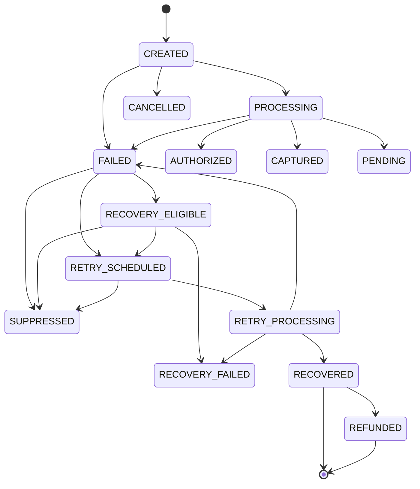

# RECLAIM — Intelligent Payment Recovery & Decisioning Platform

[](https://reclaim-oclp.onrender.com)

> 🚀 **Live Site**: [https://reclaim-oclp.onrender.com](https://reclaim-oclp.onrender.com)

RECLAIM is an enterprise-grade Payment Recovery, State Machine, Gateway Abstraction, Reconciliation, and Causal Decisioning Platform built for high-throughput payment systems (e.g. Razorpay).

It targets payment recovery interventions using heterogeneous causal uplift predictions derived from treatment-control experiments. The top 5% highest-uplift failed transactions receive targeted recovery actions (`TARGET`), while remaining transactions fall back to standard retries (`RETRY_ALL`).

---

## 🏗️ System Architecture & Platform Layering

```
                     ┌─────────────────────────────────────────────────────────┐
                     │            RECLAIM Frontend Console (SPA)               │
                     │  Executive Overview · Payment Operations · Explorer     │
                     │  Gateway Sandbox · Reconciliation & CSAT · Experiments  │
                     │  System Telemetry · Decision Console · Governance       │
                     └────────────────────────────┬────────────────────────────┘
                                                  │
                                       [REST API / HMAC Webhooks]
                                                  │
                                                  ▼
                     ┌─────────────────────────────────────────────────────────┐
                     │                FastAPI Backend Core                     │
                     │  - Causal Decision Engine (V10.2 Production Policy)     │
                     │  - Payment State Machine Manager                        │
                     │  - Outbox Pattern Event Queue Worker                    │
                     │  - Outcome Reconciliation Engine                        │
                     │  - Customer Experience CSAT Feedback Service            │
                     │  - Payment Gateway Factory (Simulator + Razorpay)       │
                     └───────────────┬─────────────────────────┬───────────────┘
                                     │                         │
            [SQLite Persistence]     │                         │   [Gateway Adapters]
                                     ▼                         ▼
                     ┌────────────────────────┐      ┌─────────────────────────┐
                     │ data/payments.db       │      │ Simulator Gateway       │
                     │ - payments             │      │ (Sandbox + HMAC Webhooks│
                     │ - payment_attempts     │      ├─────────────────────────┤
                     │ - state_history        │      │ Razorpay Gateway        │
                     │ - recovery_actions     │      │ (Production API)        │
                     │ - webhooks / outbox    │      └─────────────────────────┘
                     │ - reconciliations      │
                     │ - customer_feedback    │
                     └────────────────────────┘
```

---

## 🔄 Payment Lifecycle State Machine

RECLAIM enforces a deterministic state machine for all payment transactions:



### Valid State Transitions Contract
- `CREATED`: `[PROCESSING, FAILED, CANCELLED]`
- `PROCESSING`: `[AUTHORIZED, CAPTURED, FAILED, PENDING, CANCELLED]`
- `AUTHORIZED`: `[CAPTURED, REFUNDED, CANCELLED]`
- `CAPTURED`: `[REFUNDED]`
- `FAILED`: `[RECOVERY_ELIGIBLE, RETRY_SCHEDULED, SUPPRESSED, CANCELLED]`
- `RECOVERY_ELIGIBLE`: `[RETRY_SCHEDULED, SUPPRESSED, RECOVERY_FAILED]`
- `RETRY_SCHEDULED`: `[RETRY_PROCESSING, CANCELLED, SUPPRESSED]`
- `RETRY_PROCESSING`: `[RECOVERED, RECOVERY_FAILED, FAILED]`
- `RECOVERED`: `[REFUNDED]`

---

## 🔌 Payment Gateway Abstraction & Sandbox

The gateway abstraction interface (`backend/app/gateways/base.py`) defines a universal contract for payment providers:

* **Simulator Gateway (`backend/app/gateways/simulator.py`)**:
  - Provides a sandbox environment for testing payment failures, retries, and HMAC SHA256 signed webhooks.
  - Interactive failure injection (e.g. `INSUFFICIENT_FUNDS`, `NETWORK_TIMEOUT`, `GATEWAY_DOWN`, `AUTH_FAILED`).
  - Signed webhook payload generator (`X-Simulator-Signature`).
* **Razorpay Gateway Adapter (`backend/app/gateways/razorpay.py`)**:
  - Production adapter integrating with Razorpay API endpoints and `X-Razorpay-Signature` validation.
* **Gateway Factory (`backend/app/gateways/factory.py`)**:
  - Dynamically routes requests based on configuration or active environment.

---

## ⚖️ Outcome Reconciliation & CSAT Feedback

* **Reconciliation Engine (`backend/app/reconciliation_service.py`)**:
  - Reconciles internal payment state history, recovery action decisions, and incoming gateway webhooks.
  - Categorizes outcomes into: `MATCHED`, `PENDING`, `MISMATCHED`, `UNKNOWN`, and `MANUAL_REVIEW`.
* **Customer CSAT Feedback (`backend/app/feedback_service.py`)**:
  - Tracks customer experience CSAT ratings (1–5 scale), comments, and feedback categories (`SURVEY_CSAT`, `UNSOLICITED_COMPLAINT`, `GATEWAY_FEEDBACK`, `RECOVERY_DELAYS`).

---

## 🛡️ Production Governance & Red-Team Safeguards

* **Policy Integrity & SHA256 Verification**: Policy `causal_uplift_v10_2_predictions.csv` (10,000 transactions, 500 targeted @ 5.0%, SHA256 `034bf6682905a1ee8e4b65d3247713a4b07efaa9871eb5de0991db55fdb45e55`) is strictly immutable and verified on startup.
* **Simulation Safety Lock**: Hard-locked simulation mode (`SIMULATION_MODE=True`, `ALLOW_REAL_ACTIONS=False`) prevents unintended production charges.
* **PII Data Privacy**: Customer IDs and transaction IDs in API responses are masked (`CUS****1234`, `TXN****5678`).
* **Customer Guardrails & Frequency Caps**: Maximum 3 recovery attempts per customer, automatic 24-hour cooldown, and opt-out checking.
* **Net Value Negative Suppression**: Cancels attempts where retry fee exceeds expected recovery value.
* **HMAC SHA256 Webhook Verification**: Rejects unauthorized webhook events lacking valid HMAC signatures.

---

## 📁 Key File Paths & Datasets

| Module / Component | File Path | Description |
| :--- | :--- | :--- |
| **Immutable Production Policy** | `data/generated/causal_uplift_v10_2_predictions.csv` | V10.2 production decision policy (SHA256 locked) |
| **Payment Database** | `data/payments.db` | SQLite WAL storage for payments, attempts, history, webhooks, reconciliations, and feedback |
| **Domain Models & DTOs** | `backend/app/domain/models.py` | State machine definitions, enums, Pydantic models |
| **Payment Service** | `backend/app/payment_service.py` | Core state transition manager & DB persistence |
| **Gateway Abstraction** | `backend/app/gateways/` | `base.py`, `simulator.py`, `razorpay.py`, `factory.py` |
| **Reconciliation Engine** | `backend/app/reconciliation_service.py` | Outcome matching and reconciliation ledger |
| **Feedback Service** | `backend/app/feedback_service.py` | CSAT feedback submission & analytics engine |
| **Queue Worker** | `backend/app/queue_worker.py` | Asynchronous outbox event queue processor |
| **Frontend SPA** | `frontend/src/` | React 18 / Vite obsidian-themed dashboard with 12 view tabs |
| **Automated Test Suite** | `tests/` | Unit & integration tests for policy, state machine, gateway, and reconciliation |

---

## 🚀 Running the Platform

### 1. Launch Backend Server & API Gateway
Run the following command from `D:\RECLAIM`:

```bash
python backend/app/main.py
```

FastAPI server runs at `http://localhost:8000`.

### 2. Run Automated Test Suite
To run all unit and integration tests across the platform:

```bash
python -m unittest discover -s tests
```

---

## 📊 Governance Principles & Verification

1. **Immutable Policy File**: V10.2 predictions are loaded read-only on startup. No re-ranking or artificial score adjustments are made.
2. **Strict Targeting Rate**: Exactly 500 / 10,000 transactions (5.0%) are selected for `TARGET`.
3. **No Lineage Fabrication**: Production transaction IDs are not joined with historical outcomes without a valid bridge.
4. **Oracle Field Isolation**: Oracle counterfactual fields are strictly excluded from runtime production APIs.
